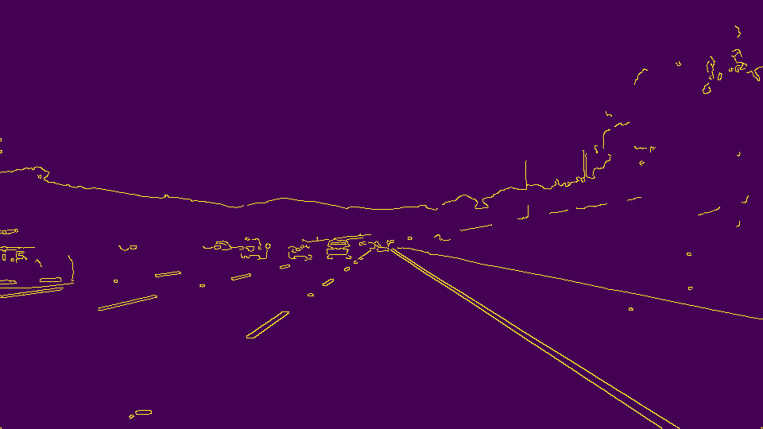
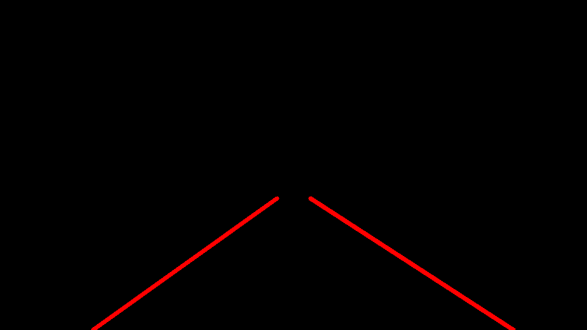
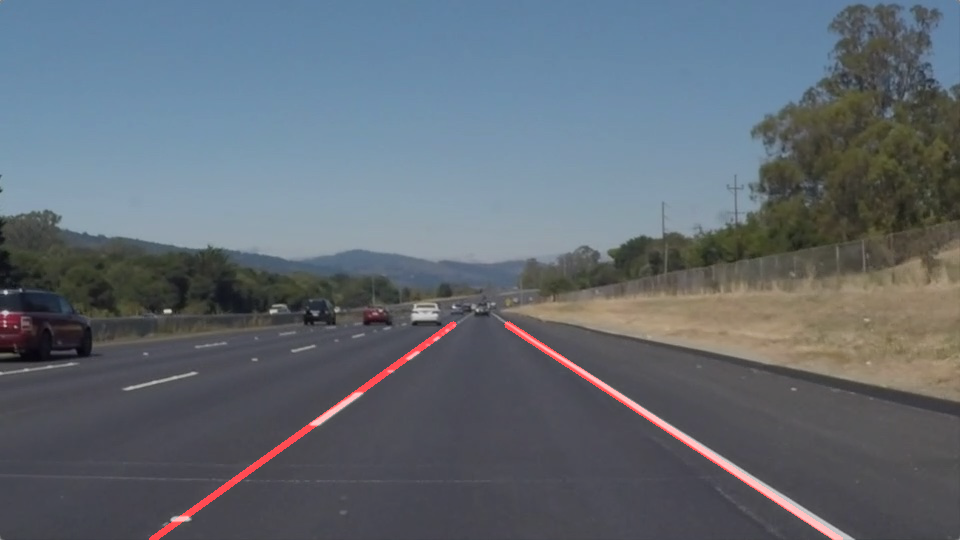

# **Finding Lane Lines on the Road** 

## Reflection

### My Lane Detection Pipeline

First I convert the original image to grayscale.  

Next I blur the image using a gaussian blur in order to remove noise and spurious edges. 

Next I apply the Canny edge detector to find edges in the image. 

Next I remove parts of the image that are unlikely to contain lane markings using an image mask.  The image mask I chose to use is trapezoidal in shape.

Then I apply a hough transformation to detect lines in the image.  I attempt to group the detected line segments by right and left lane by using their slope.  Line segments with a positive slope are considered to be part of the right lane markings and negative slope are considered to be part of the left lane.  Horizontal lines are filtered out.  Once the line segments are grouped by their lane (left or right) they are combined together by taking the RANSAC fit of their endpoints.  This was done in an attempt to filter outliers.  Originally I tried a linear regression of the endpoints, but found the line to jump significantly between frames due to outliers.

Finally I overlay the output of the previous Hough tranformation with the original image.

### Pipeline Shortcomings
Sometimes lines are detected that are not lane markings, but still appear in the masked region.  In the challenge video this happens frequently due to the visibility of the hood as well as the guard rail.  Since there is currently nothing that filters out these lines they contribute to the RANSAC fit and distort the lane lines. 

### Possible Improvements

Some possible improvements might include better filtering of lines that are not lane markings.  One possible filter might be to only include lines that have a slope within a certain range.  Currently only horizontal (zero slope) is being filtered out.  Another possible improvement might be to reduce the mask area to include less of the periphery.  This might come at the cost of legitimate detections though so that must be considered.  

